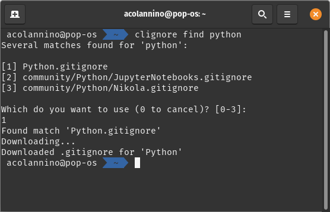

# CLIgnore
> *clignorance is bliss*

CLIgnore is a simple command-line tool to find .gitignore files based on your language or framework. It uses the [GitHub API](https://developer.github.com/v3/) to search for template files from GitHub's official [repo](https://github.com/github/gitignore), so you can automagically download and use them in your projects in no-time.

## Rationale
.gitignore files are annoying and I hate them. While many IDEs and version control tools generate .gitignore files for you, that's not always the case. So instead of constantly Googling for the gitignore repo, finding the right template, copying the template, and pasting it in my project *like a schmuck*... I made a tool that does it for me (and you!)

## Usage
### Find


Use `clignore find` to search based on your langauge or framework, and select the file you need. If CLIgnore finds only 1 file matching your search, it'll be automatically download.

### Everything else
```
FLAGS:
    -h, --help       Prints help information
    -V, --version    Prints version information

ARGS:
    <token>    Sets the OAuth2 token for authenticated requests [env: TOKEN=]

SUBCOMMANDS:
    authenticated    Checks the GitHub API to see if you have an authorization token present
    find             Finds files by name
    help             Prints this message or the help of the given subcommand(s)
    list             Lists all gitignore template files
```

### Setting an OAuth2 token
The GitHub API rate-limits users to 60 requests in 1 hour. If, for some reason, you need more than this, CLIgnore allows you to set an OAuth2 token via an enviornment variable: `TOKEN=<your super-secret token here> clignore find python`

Authenticated requests can make up to 5000 requests per hour. More on that [here](https://developer.github.com/v3/#rate-limiting).

## Installation

## Roadmap
- Some kind of CI/CD would be nice
- The error handling is pretty lazy. I'm just doing a bunch of `unwrap`s in `main`, so while errors are displayed to the user, they're not very pretty. 